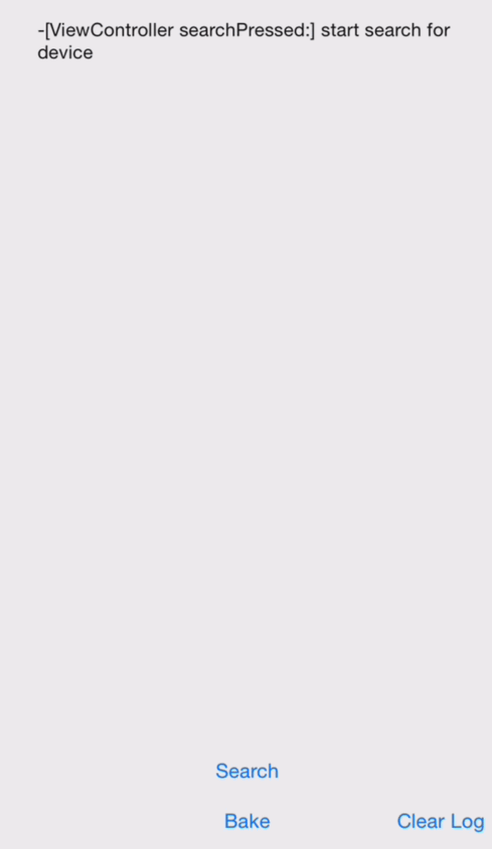

# Pizza

  ios BLE Example communicate with https://github.com/sandeepmistry/bleno pizza example 

  I have rised a question about running bleno on rpi but lake of guidience 

  https://github.com/sandeepmistry/bleno/issues/103#issuecomment-95353110

  so that create this example 

  


## installation (iOS)

  ```pod install```

  ```open Pizza.xcworkspace```

##Run bleno Pizza example (Mac)

  check out https://github.com/sandeepmistry/bleno/tree/master/examples/pizza

##Run bleno Pizza example (Raspberry Pi)

  https://github.com/sandeepmistry/bleno#ubuntudebianraspbian


##Roadmap (TODO)
  Fancier UI on iOS 

## Caution

  * in no reason all UUIDs should be in lowercase
